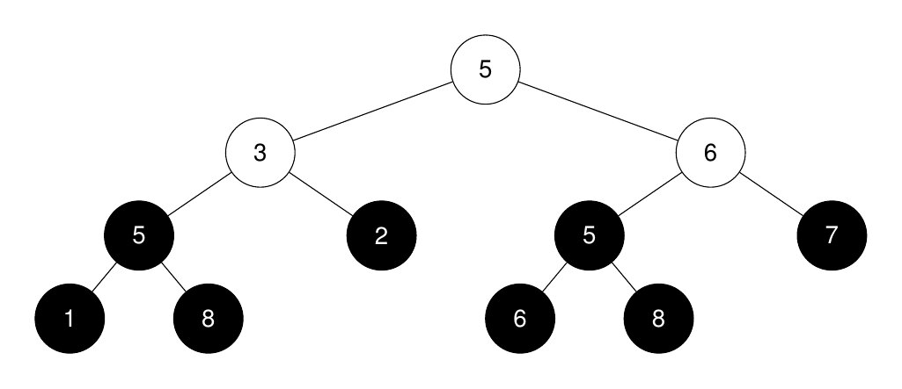
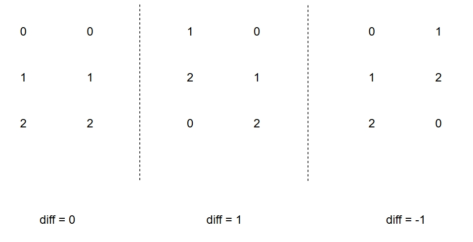

心路历程：<br>
1. 前2题目没有考虑性质，写了很长的代码
2. 第三题优化问题超时
3. 第四题没看到（补）

## 1.

## 2. 第k大的完美二叉树的大小

给你一棵**二叉树** 的根节点 `root` 和一个整数 `k`。<br>
返回第 `k` 大的完美二叉子树的大小，如果不存在则返回 `-1`。<br>
**完美二叉树** 是指所有叶子节点都在同一层级的树，且每个父节点恰有两个子节点。

示例1：
```bash
input: root = [5,3,6,5,2,5,7,1,8,null,null,6,8], k = 2
output: 3
```
解释：

完美二叉子树的根节点在图中以黑色突出显示。<br>
它们的大小按非递增顺序排列为 `[3, 3, 1, 1, 1, 1, 1, 1]`。<br>
第 `2` 大的完美二叉子树的大小是 3。


## 解答：
<p>
根据完美二叉树的定义，一颗高度为 `h` 的完美二叉树，从上往下，每一层有 $1, 2, 4, ..., 2^{h-1}$ 个节点，其子树的大小为 $1 + 2 + 4 + ... + 2^{h-1}$ = $2^h-1$，这样通过子树的高度既可确认子树的大小，我们在 **dfs** 中传参只需要传入高度即可。<p>
**判断条件**：
- 当前节点为空，返回 0
- 对于完美二叉树，左右子树的高度应该相等，判断如果相等则返回 `leftH+1`，否子返回`-1`

```go
func kthLargestPerfectSubtree(root *TreeNode, k int) int {
    ans := []int{}
    var dfs func(node *TreeNode) int
    dfs = func(node *TreeNode) int {
        if node == nil {
            return 0
        }
        leftH := dfs(node.Left)
        rightH := dfs(node.Right)
        if leftH < 0 || rightH < 0 || leftH != rightH {
            return -1 // 不合法
        }
        ans = append(ans, leftH+1)
        return leftH + 1
    }
    dfs(root)
    // 完美二叉树的数量 < k 返回 -1
    if k > len(ans) {
        return -1
    }
    slices.Sort(ans)
    return 1<<ans[len(ans)-k] - 1
}
```

# 3. 统计能获胜的出招序列数
Alice 和 Bob 正在玩一个幻想战斗游戏，游戏共有 `n` 回合，每回合双方各自都会召唤一个魔法生物：火龙（`F`）、水蛇（`W`）或地精（`E`）。每回合中，双方 同时 召唤魔法生物，并根据以下规则得分：

- 如果一方召唤火龙而另一方召唤地精，召唤 **火龙** 的玩家将获得一分。
- 如果一方召唤水蛇而另一方召唤火龙，召唤 **水蛇** 的玩家将获得一分。
- 如果一方召唤地精而另一方召唤水蛇，召唤 **地精** 的玩家将获得一分。
- 如果双方召唤相同的生物，那么两个玩家都不会获得分数。

给你一个字符串 `s`，包含 n 个字符 `'F'`、`'W'` 和 `'E'`，代表 Alice 每回合召唤的生物序列：

- 如果 `s[i] == 'F'`，Alice 召唤火龙。
- 如果 `s[i] == 'W'`，Alice 召唤水蛇。
- 如果 `s[i] == 'E'`，Alice 召唤地精。

Bob 的出招序列未知，但保证 Bob 不会在连续两个回合中召唤相同的生物。如果在 `n` 轮后 Bob 获得的总分 严格大于 Alice 的总分，则 Bob 战胜 Alice。

返回 Bob 可以用来战胜 Alice 的不同出招序列的数量。

由于答案可能非常大，请返回答案对 $10^9 + 7$ **取余**后的结果。<p>
示例1：
```bash
input: s = "FFF"
output: 3
```
解释：
Bob 可以通过以下 3 种出招序列战胜 Alice：`"WFW"`、`"FWF"` 或 `"WEW"`。

## 解答：
<p>
像打家劫舍一样，我们从后往前思考
因为不能连续2回合召唤相同的生物，我们需要一个变量来记录上个回合使用的生物，即这回合不能使用的生物<br>
我们在递归的过程中维护3个变量：<br>

- `i` : 当前回合
- `diff` ：当前和对手的分差
- `ban` ：上个回合使用的生物，即这回合不能使用的生物

因此，定义`dfs(i, diff, ban)`为从`i`到`0`个回合，当前和对手的分差为`diff`，且第`i`回合我们无法召唤的生物为`ban`的情况下，战胜对手的不同出招序列的数量<p>
下一步是思考如何定义状态转移<br>
在[灵茶山艾府的周赛讲解](https://www.bilibili.com/video/BV1zU2zYiEa4/?spm_id_from=333.337.search-card.all.click&vd_source=3dea5bb65f58ca676b979c20b9f44ce4)中对`F`，`W`，`E`修改分别记作`0`，`1`，`2`，即枚举第`i`回合召唤的生物为 `k = 0，1，2 && k != ban`。
```go
mp := {"F: 0", "W: 1", "E: 2"}
```

我们希望`diff`的值如下图所示（左右侧分别代表我方和对方选择生物）：<br>

这样看起来很完美，但是有 2 个特殊的组合该怎么处理？我们定义`0`，`1`，`2`的好处就来了，也就是3个值轮换，我们注意到有三个数字意味着`(diff + 3) % 3 = diff`，这样做可以比较好地处理所有的情况了，额外计算一下`score = 2`的情况即可，计算第`i`回合的差值`score`为：
```go
score := (k - mp[s[i]] + 3) % 3
if score == 2 {
    score = -1
}
```

显然，我们要记录从i到0的战胜对手不同出招序列的数量，又存在大量的递归调用，我们可以采取记忆化搜索的方式
1. 查看一下当前状态是否已经被计算过
   - 不是：将状态及其结果记录到`memo`数组中
   - 是：return `memo`保存的结果
2. 然后枚举这回合能召唤的生物`k`且`k!=ban`
   - 计算`score`
   - 问题变成从`i-1`到`0`，我们和对手的分差为`diff+score`且第`i-1`回合我们无法召唤生物为`k`的情况下，战胜对手的不同出招序列的数量，`dfs(i−1,diff+score,k)`
3. 维护`res`累加`dfs(i−1,diff+score,k)`，记录在`dfs(i,diff,ban)`中

这里注意 2 个减枝
```go
if -diff > i {
    return
}
if diff > i+1 {
    return pow2[i+1]
}
```
- 如果 `-diff > i`，意味着现在的分差在后面的回合中全胜也无法战胜对手，返回 0
- 如果 `diff > i`，意味着即使后面全败也能战胜对手，因为还剩下`i+1`个回合，每回合去掉`ban`的生物，每回合能召唤 2 个生物中的一个，方案数为 $2^{i+1}$，返回 $2^{i+1}$

```go
func countWinningSequences(s string) int {
    const mod = 1_000_000_007
    n := len(s)
    
    pow2 := make([]int, (n+1)/2)
    pow2[0] = 1
    for i := 1; i < len(pow2); i++ {
        pow2[i] = pow2[i-1] * 2 % mod
    }

    mp := [...]int{'F': 0, 'W': 1, 'E': 2}
    memo := make([][][3]int, n)
    for i := range memo {
        memo[i] = make([][3]int, n*2+1)
        for j := range memo[i] {
            memo[i][j] = [3]int{-1, -1, -1}
        }
    }
    /* 
    i：第i回合，对手召唤是s[i]
    diff：分差
    ban：这回合我们不能召唤的生物
    */
    var dfs func(int, int, int) int
    dfs = func(i, diff, ban int) (res int) {
        if -diff > i {
            return
        }
        if diff > i+1 {
            return pow2[i+1]
        }
        p := &memo[i][diff+n][ban]
        if *p != -1 {
            return *p
        }
        for k := 0; k < 3; k++ { // 枚举这回合能召唤的生物
            if i == n-1 || k != ban {
                score := (k - mp[s[i]] + 3) % 3
                if score == 2 {
                    score = -1
                }
                res += dfs(i-1, diff+score, k)
            }
        }
        res %= mod
        *p = res
        return
    }
    return dfs(n-1, 0, 0)
}
```